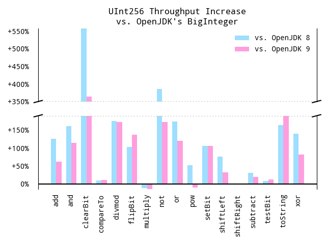

# JUInt 

Optimized, immutable Java implementations of fixed-width, unsigned
integers.  Currently 128 bit (`UInt128`) and 256 bit (`UInt256`) variants
are available (with identical, `BigInteger`-style interfaces).  It'd
be trivial to offer differently sized integers with the same semantics, as all
operations are implemented statically in terms of arrays, with the maximum width
specified at runtime.

`juint` requires Java 8.

## Performance

Ignoring constant overhead, per-instance memory consumption is identical to
`BigInteger`'s best case - i.e. an array holding the minimum number of
integers required to represent a given number - never zero prefixed.

Operation throughput is expected to be significantly higher than OpenJDK's
`BigInteger` in almost all cases (often dramatically so).  There are
exhaustive JMH micro-benchmarks per operation & magnitude in the `bench`
subproject.

Each operation's bar represents the average throughput across all of its
magnitude-specific benchmark cases, relative to identical benchmarks which
operate on `BigInteger`.  Typically, in the case of `UInt256`, there'd be
separate cases for one word, two words, four words (half) and 8 words (full),
each operating on a range of similarly wide values.

Erring on the side of fairness, the `BigInteger` reference benchmarks only
include the cost of constraining the result within the maximum width _if the operation
will overflow_.  As this particular approach requires a degree of foreknowledge
that likely exists only in a minority of real-life use cases, relative throughput
may be significantly improved from that depicted.

The -10% `multiply` disparity above is due to HotSpot's intrinsification of
`BigInteger.multiplyToLen`, a private method used by `BigInteger.multiply` (and
`pow`, by association) - obviously not an optimization strategy available to
library code.

## License

Like OpenJDK itself, `juint` is distributed under the terms of the _GNU General
Public License_ (version 2) **with the classpath exception**:

> ...The copyright holders of this library give you permission to link this
> library with independent modules to produce an executable, regardless of the
> license terms of these independent modules...

Please see the accompanying `LICENSE` file for details.

### GPL Notes

As mentioned, `juint` offers an interface compatible with `BigInteger`, and
follows a similar strategy to OpenJDK for division and the `(String, int)`
constructor.  While I don't consider it a _derived work_, I don't want to have
to explain that to Gavin Belson in a courtroom.

Despite a strong personal preference for Public Domain software, retaining OpenJDK's
license seems the prudent choice, and doesn't place additional burden on those
consuming this project.
