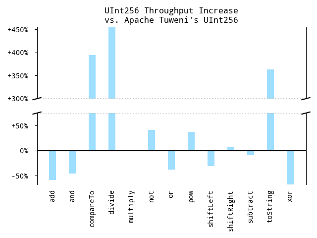

<p align="right">
Moe Aboulkheir<br />
2023-01-14<br/>
<a href="https://github.com/nervous-systems/java-unsigned-integers"></a>

</p>

# Performance Pathologies in OpenJDK's BigInteger Implementation

Many and many a year ago (in a kingdom by the sea), I wrote some fixed-width
integer types without sign, with alacrity.

In Java, nominally for a
[Clojure Ethereum VM](https://github.com/nervous-systems/sputter)
project, though completely unnecessary &mdash; I was on a work trip, it was the
weekend, and it was either that or the minibar. I did some benchmarking, and I
got some pretty ridiculous numbers, against what were two most recent major
OpenJDK versions at the time:


N.B. The
[project](https://github.com/nervous-systems/java-unsigned-integers) includes
`UInt128` and `UInt256`, however these are trivial wrappers around a
general-purpose
[Arrays.java](https://github.com/nervous-systems/java-unsigned-integers/blob/master/juint/src/main/java/io/nervous/juint/Arrays.java),
which can operate on arbitrarily wide integers, as long as there is an
upper-bound on their length &mdash; adding smaller or larger `uint` types would not
be a problem.

## About Those Benchmarks

Each bar is an aggregate of around 10 JMH microbenchmarks (170 altogether) per
operation, performed with numbers of different magnitudes. With the generosity
of a dying aunt, I only mod 2<sup>256</sup> the `BigInteger`instance when it's known that
it's exceeeded the desired capacity &mdash; mostly not how things work in
real life, when dealing with arbitrary values. So, these are worst-case
speedups.

 - Almost every operation is twice as fast as OpenJDK 8.
 - `UInt256`'s concomitants of the slowest `BigInteger` operations (`clearBit` and `toString`), do not benefit from the fact that the width of the number
 is fixed.  Something else is going on.
 - The only cases where `BigInteger` is faster are due to the use of intrinsics,
   and even then, it's basically getting nowhere.

 ### Updated Benchmarks

 I'd been meaning to write an article like this for a while, so after 5 years I re-ran
 the benchmarks against a recent GraalVM (since that's the JVM I was using), and OpenJDK 19.

 

Basically everything is at OpenJDK 9 levels, except the intrinsics are faster.
Let's take a tour of the source of `UInt256` and OpenJDK 8 and 19's `BigInteger`
to see if we can't get a handle on some of these larger discrepancies.

# `clearBit`

Here's my `UInt256.clearBit`

```java
public final class UInt256 extends UInt<UInt256> {
...
  public UInt256 clearBit(final int bit) {
    if(bit < 0)
      throw new ArithmeticException("Negative bit address");
    return ((ints.length <= bit >>> 5) ? this :
            new UInt256(Arrays.clearBit(ints, bit)));
  }
}
```

(`ints` is a little endian array of integers, with no leading zeroes).

The
only logic here is that we don't do any work if the bit falls outside the bounds
of `ints`.  `Arrays.clearBit`:

```java
final class Arrays {
...
  static int[] clearBit(final int[] a, final int bit) {
    final int alen = a.length;
    final int i    = alen - (bit >>> 5) - 1;
    final int v    = a[i] & ~(1 << (bit & 31));

    if(v == a[i])
      return a;

    if(i != 0 || v != 0) {
      final int[] out = copyOf(a, alen);
      out[i]          = v;
      return out;
    }
    return stripLeadingZeroes(a, 1);
  }
}
```

## Trivial Optimizations
 - Return the unmolested array if the bit is already clear.
 - If it's not the zeroth int, or clearing the bit won't zero the int, don't
   bother looking for leading zeroes.
 - Otherwise, remove the first int without inspecting it (second arg to
   `stripLeadingZeroes`), as we know it's zero, and scan forward for the first
   non-zero value before copying:

```java
final class Arrays {
...
  static int[] stripLeadingZeroes(final int[] ints, int strip) {
    final int len = ints.length;

    for(; strip < len && ints[strip] == 0; strip++)
      ;
    return strip == 0 ? ints : copyOfRange(ints, strip, len);
  }
}
```

I'm _dying_ to know what OpenJDK 8 is doing.

```java
public class BigInteger extends Number implements Comparable<BigInteger> {
    ...
    public BigInteger clearBit(int n) {
        if (n < 0)
            throw new ArithmeticException("Negative bit address");

        int intNum = n >>> 5;
        int[] result = new int[Math.max(intLength(), ((n + 1) >>> 5) + 1)];

        for (int i=0; i < result.length; i++)
            result[result.length-i-1] = getInt(i);

        result[result.length-intNum-1] &= ~(1 << (n & 31));

        return valueOf(result);
    }
}
```

If the bit is out of bounds, and I'm reading right, it's _growing_ the integer
array to a size bounded by 2<sup>32</sup> / 32 (approx 10<sup>8</sup>, the biblical lower
bound on the number of angels[^1]), to
"clear" a bit which wouldn't otherwise exist &mdash; then stripping all of the leading
zeroes in the `int[]` constructor used by `valueOf`, resulting in exactly the
same number! You don't see this kind of thing every day, top class stuff. I was keen to see how OpenJDK 19 had sped
this up, but it's doing _exactly_ the same thing! The speedup must come from
some ancillary method/s (e.g. `getInt`, `valueOf`, etc.), overall runtime
optimizations, or some combination. Pandaemonium.  Let's take a look at throughput graph
with `clearBit` thrown out:


[^1]: Proof in [Revelation 5:11](https://bible.bibleask.org/#/search/Revelation%205:11/KJV).

# `setBit`

While not as dramatic, my `setBit` implementation is 200% faster.  Let's take a look
at what's happening with `BigInteger`.

```java
public class BigInteger extends Number implements Comparable<BigInteger> {
...
    public BigInteger setBit(int n) {
        if (n < 0)
            throw new ArithmeticException("Negative bit address");

        int intNum = n >>> 5;
        int[] result = new int[Math.max(intLength(), intNum+2)];

        for (int i=0; i < result.length; i++)
            result[result.length-i-1] = getInt(i);

        result[result.length-intNum-1] |= (1 << (n & 31));

        return valueOf(result);
    }
}
```

This is a little goofy &mdash; if the corresponding integer (`n >>> 5`) exists
in the integer array, why not check if the bit is _already_ set before doing any
allocating? Compare:

```java
final class Arrays {
...
  static int[] setBit(final int[] a, final int bit) {
    final int i    = bit >>> 5;
    final int alen = a.length;

    if(i <= alen - 1) {
      final int j = alen - i - 1;
      final int v = a[j] | 1 << (bit & 31);
      if(v == a[j])
        return a;
      final int[] out = copyOf(a, alen);
      out[j]          = v;
      return out;
    }

    final int[] out = new int[i + 1];
    System.arraycopy(a, 0, out, out.length - alen, alen);

    out[0] = 1 << (bit & 31);
    return out;
  }
}
```

# `flipBit`

In general, there are some speedups to be had by closely coupling the
zero-stripping code with the array arithmetic, as we often know accidentally
(e.g. if there's a carry left over), or with a cheap check, whether we need to
scan for leading zeroes or not (as we saw with `clearBit`. We use this to our
advantage in `flipBit`, also, and gain a `150%+` speedup:

```java
final class Arrays {
...
  static int[] flipBit(final int[] a, final int bit) {
    final int i    = bit >>> 5;
    final int alen = a.length;

    if(i < alen - 1) {
      final int[] out = copyOf(a, alen);
      final int j     = alen - i - 1;
      out[j]         ^= (1 << (bit & 31));
      return out;
    }

    final int[] out = new int[i + 1];
    System.arraycopy(a, 0, out, out.length - alen, alen);

    return (out[0] ^= (1 << (bit & 31))) == 0 ? stripLeadingZeroes(out, 1) : out;
  }
}
```

This method could be further optimized. We also get a marginal gain in
`UInt256.flipBit`, as we can ignore bits which fall out of bounds, though this
wouldn't be exercised by the benchmarks. Anyway, enough with the bits. Let's
take a look at `toString`.

# `toString`

`toString` accepts a radix in which to represent the number, so it does a bunch
of `divideAndRemainder` calls, and despite both implementing Knuth's Algorithm
D, division is substantially faster in `UInt256` &mdash; which probably accounts for a
large degree of the disparity.

```java
public abstract class UInt<T extends UInt>
  extends Number
  implements Comparable<T> {
  ...
  public final String toString(int radix) {
    if(isZero())
      return "0";

    if(radix < Character.MIN_RADIX || Character.MAX_RADIX < radix)
      radix = DEFAULT_RADIX;

    if(ints.length == 1)
      return Integer.toUnsignedString(ints[0], radix);
    if(ints.length == 2)
      return Long.toUnsignedString(((ints[0] & LONG) << 32) | (ints[1] & LONG), radix);

    return StringUtil.toString(ints, radix);
  }
}
```

I think these length checks (absent in `BigInteger`) probably account for the
rest, in the lower-magnitude test cases. `BigInteger` immediately falls back to
Schoenhage radix conversion if the number within some range (2<sup>256</sup> is
comfortably within this range), which is what `StringUtil.toString` does, above.
Anything we can do to avoid that'll be a big win.

# Other Fixed-width Integer Implementations

Someone recently pointed me at [Apache Tuewni's UInt256
implementation](https://github.com/apache/incubator-tuweni/blob/main/units/src/main/java/org/apache/tuweni/units/bigints/UInt256.java).
It looked a little eccentric, but I wanted to benchmark it regardless.  I should have
broken the Y-axis here also, but I lack the energy of my 33 year old self.



Unlike [java-unsigned-integers](https://github.com/nervous-systems/java-unsigned-integers) (the project containing my implementation of `UInt256`, etc.), Tuweni's `UInt256` is less
concerned about genericity, and performs arithmetic directly in its class, rather than
deferring to something like `Arrays.java` as shown above.  This means its loops, e.g.:

```java
public final class UInt256 implements UInt256Value<UInt256> {
  ...
  public UInt256 xor(UInt256 value) {
    int[] result = new int[INTS_SIZE];
    for (int i = INTS_SIZE - 1; i >= 0; --i) {
      result[i] = this.ints[i] ^ value.ints[i];
    }
    return new UInt256(result);
  }
}
```

are trivial to unroll, and it seems unconcerned, generally, with leading zeroes.
This comes at some cost &mdash; if you wanted to implement `UInt512`, you'd have
to copy and paste all of this code. Although, against that trade-off, I'll
happily take some 25%-50% losses along with some 300%-450% gains.

Thanks for reading! Open an issue or a PR if you have ideas about further
speedups.
<p align="center"> <a
href="https://github.com/nervous-systems/java-unsigned-integers"></a> </p>
